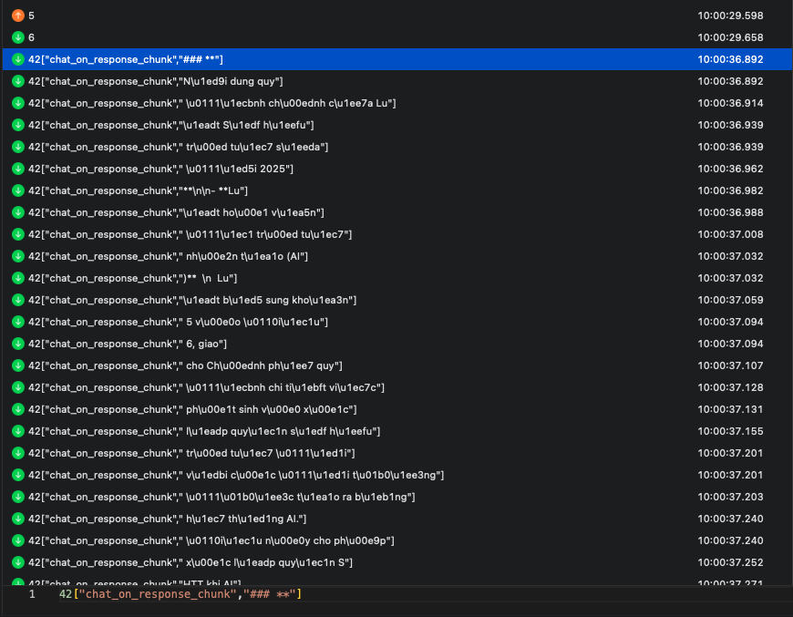
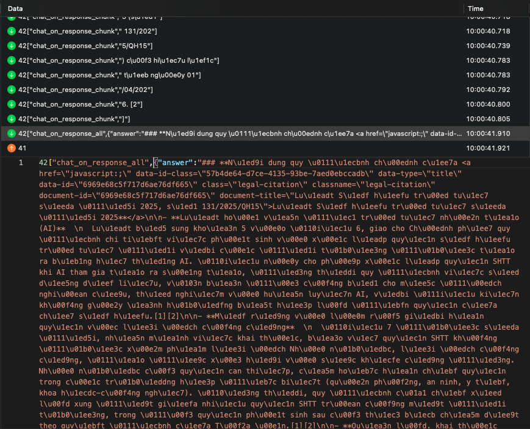
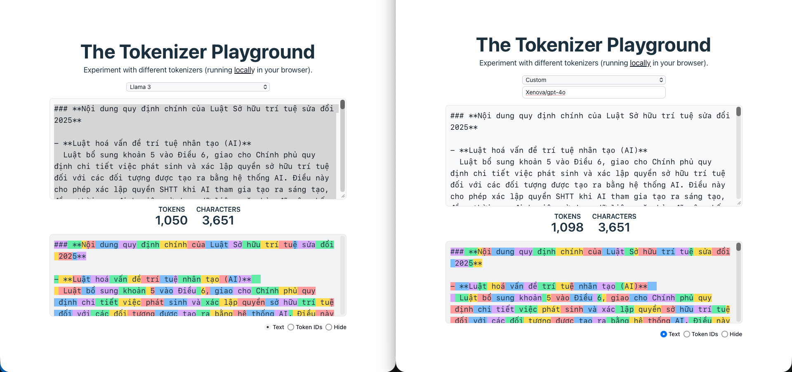
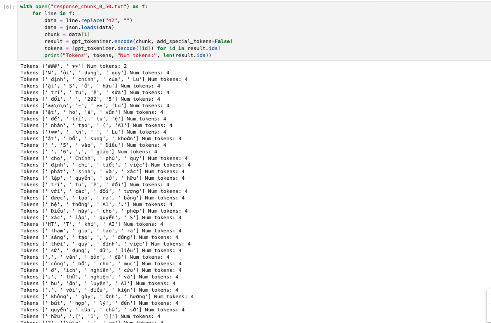
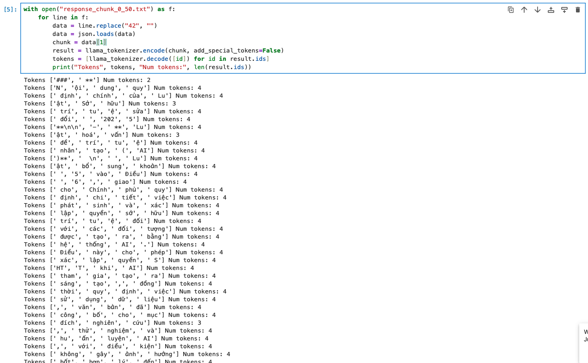

import Callout from '@/components/Callout.astro'

## Sao lại có phần 2?

Sau [bài trước](/blog/reverse-engineering-tgdv/), có mấy ông bảo là LLaMa 3 70B cũng tokenize tiếng Việt kiểu kiểu như `o200k_base` của OpenAI, nên bằng chứng mình đưa ra chưa chắc đã đúng. Để cho chắc chắn, mình quyết định "mổ xẻ" kỹ hơn để tìm bằng chứng thực tế hơn.

## Soi vào file packet thô (Raw Data)

Lần này mình không chỉ nhìn text nữa mà soi thẳng vào cấu trúc packet (chunk) gửi về qua WebSocket. 


*Packet WebSocket bắt được, mỗi lần `chat_on_response_chunk` là một cụm dữ liệu.*

Và đây là toàn bộ mớ data sau khi log lại:


*Dữ liệu thô từ server.*

## Tokenizer: Giống nhưng không phải là một

Mình ném mớ text bắt được vào [Hugging Face Tokenizer Playground](https://huggingface.co/spaces/Xenova/the-tokenizer-playground) để so sánh.

Đúng là nhìn qua thì LLaMa 3 và GPT-4o ngắt từ khá giống nhau. Nhưng soi kỹ vào mấy từ hiếm hoặc cách build vocabulary thì sẽ thấy khác biệt.


*Nhìn tổng thể thì khá tương đồng.*


*Nhưng soi kỹ sẽ thấy cách xử lý các từ có tần suất khác nhau giữa 2 bộ tokenizer.*

## Mấu chốt: Ranh giới của các Chunk

Đây là bằng chứng đanh thép nhất. Khi stream dữ liệu, server sẽ gửi về từng cụm (chunk). Mình viết một đoạn script nhỏ để check: ném mấy cái chunk thực tế đó vào tokenizer của LLaMa và GPT xem nó ra bao nhiêu token.

```python title="tokenizer_check.ipynb"
# Check xem mỗi chunk chứa bao nhiêu token thực tế
with open("response_chunk_0_50.txt") as f:
    for line in f:
        # ... logic parse ...
        result_gpt = gpt_tokenizer.encode(chunk)
        result_llama = llama_tokenizer.encode(chunk)
        
        print(f"GPT: {len(result_gpt)} tokens | LLaMa: {len(result_llama)} tokens")
```

**Kết quả khá rõ ràng:**

1.  **GPT (o200k):** Mỗi chunk bắt được **luôn luôn là 4 tokens**. 

*Số lượng token trong mỗi chunk của GPT luôn cố định là 4.*

2.  **LLaMa:** Số token trong mỗi chunk nhảy lung tung, lúc 3, lúc 4.

*Số lượng token biến thiên liên tục khi dùng tokenizer của LLaMa.*


Tại sao lại thế? Vì server chia chunk dựa trên ranh giới token của mô hình nó đang dùng. Nếu dùng LLaMa thì ranh giới chunk phải khớp với tokenizer của LLaMa. Đằng này nó lại khớp khít với GPT.

<Callout title="Tự kiểm chứng" variant="note">
Ai không tin có thể tải file này về tự chạy:
- [tokenizer_check.ipynb](/blog/reverse-engineering-tgdv-part-2/assets/tokenizer_check.ipynb)
- [response_chunk_0_50.txt](/blog/reverse-engineering-tgdv-part-2/assets/response_chunk_0_50.txt)
</Callout>

## Chốt lại

Đến đây thì coi như xong. TGDV chắc chắn vẫn dùng **OpenAI (o1-mini hoặc GPT-4o)** để generate câu trả lời cuối cùng. Còn LLaMa 70B mà mình thấy ở phần 1 khả năng cao chỉ làm mấy việc râu ria như phân loại hay tiền xử lý để tiết kiệm tiền thôi.
